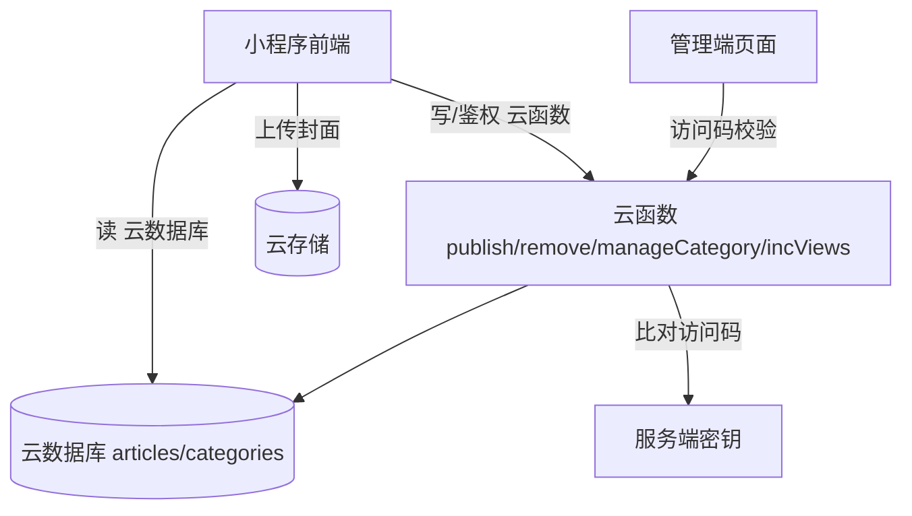

## 用户需求

使用微信小程序原生开发个人简单博客，初期免费、可在线访问，文章内容通过小程序内隐藏的管理端进行维护。

## 产品概述

一个基于微信云开发的个人博客小程序。读者可浏览文章列表、查看文章详情，并按分类与标签筛选内容；博主通过首页隐藏入口（访问码验证）进入管理端，在小程序内完成文章的发布、编辑、删除以及分类管理，无需另行搭建服务器或后台系统。

## 核心功能

- 文章列表：首页分页加载已发布文章，展示封面、标题、摘要、分类与标签、阅读量
- 文章详情：富文本渲染正文，展示阅读量、发布时间，进入即自增阅读数
- 分类与标签：横向分类切换与标签筛选，进入分类/标签结果页
- 小程序内管理端：访问码保护的隐藏入口，文章增删改查与分类管理
- 云数据托管：云数据库存储文章与分类，云函数负责发布鉴权与阅读量统计

## 技术栈

- 前端框架：微信小程序原生（WXML / WXSS / JS，可选 TypeScript）
- UI 组件库：tdesign-miniprogram（企业级小程序设计系统，npm 构建引入）
- 后端/数据：微信云开发 CloudBase —— 云数据库（文档型集合）、云函数、云存储（封面图）
- 富文本方案：小程序原生 `rich-text` 组件渲染 HTML 富文本；管理端编辑采用轻量富文本输入生成 HTML
- 构建/发布：微信开发者工具（编译、云环境初始化、云函数上传部署）

## 实现方案

采用"小程序原生 + 云开发"一体化架构：前端直连云数据库读取已发布文章，写操作经云函数鉴权后落库，兼顾免费、免运维与可扩展。

### 关键决策

1. **云数据库直读 + 安全规则**：读者端直接查询 `articles`（仅 status='published'）与 `categories`，数据库安全规则限制公开只读，避免每条请求走云函数，降低延迟与调用量。
2. **云函数负责写与鉴权**：发布/编辑/删除/分类管理统一通过云函数执行，云函数内校验访问码（服务端比对），防止越权写入。
3. **访问码隐藏入口**：首页"我的"页输入访问码 → 调用云函数校验 → 本地缓存 token 进入管理端，访问码不硬编码于可前端篡改处。
4. **富文本存储**：正文以 HTML 存储，`rich-text` 直接渲染；列表查询仅返回必要字段，不返回完整正文，降低传输体积。
5. **分页**：首页 `skip/limit` + `onReachBottom` 分页，配合 `startPullDownRefresh`，单次读取 10 条。

### 性能与可靠性

- 列表查询投影必要字段，封面返回云存储压缩缩略图 URL。
- 分类数据量小，本地 `setStorageSync` 缓存，减少重复查询。
- 阅读量走云函数 `db.command.inc` 原子自增，避免并发覆盖。
- `rich-text` 节点白名单控制，防止 XSS。

## 架构设计

### 系统结构



前端分三层：页面层（pages）、可复用组件层（components）、工具/数据访问层（utils + 云函数封装）。

## 目录结构

```
WuWeBlog/
├── project.config.json          # [MODIFY] 小程序配置：AppID、miniprogramRoot、cloudfunctionRoot、npm
├── project.private.config.json  # [NEW] 本地私有配置（不入库）
├── sitemap.json                 # [NEW] 索引配置
├── miniprogram/
│   ├── app.js                   # [NEW] 全局逻辑：wx.cloud.init 初始化云环境
│   ├── app.json                 # [NEW] 页面注册、窗口样式、tabBar
│   ├── app.wxss                 # [NEW] 全局样式变量与基础样式
│   ├── pages/
│   │   ├── index/              # [NEW] 首页：文章列表 + 分类标签筛选
│   │   ├── detail/             # [NEW] 文章详情：rich-text 渲染 + 阅读量自增
│   │   ├── category/           # [NEW] 分类/标签筛选结果页
│   │   └── admin/              # [NEW] 管理端：访问码 + 文章/分类 CRUD
│   ├── components/
│   │   ├── article-card/       # [NEW] 文章卡片（封面/标题/摘要/标签）
│   │   ├── category-bar/       # [NEW] 横向分类切换条
│   │   └── tag-list/           # [NEW] 标签展示组件
│   ├── utils/
│   │   ├── cloud.js            # [NEW] 云数据库/云函数调用封装
│   │   ├── format.js           # [NEW] 日期格式化、摘要截取
│   │   └── auth.js             # [NEW] 访问码校验与本地登录态缓存
│   └── style/
│       └── theme.wxss          # [NEW] 主题色、间距变量
└── cloudfunctions/
    ├── publish/                # [NEW] 发布/更新文章（访问码校验 + 写库）
    ├── removeArticle/          # [NEW] 删除文章
    ├── manageCategory/         # [NEW] 分类增删改
    └── incViews/               # [NEW] 阅读量原子自增
```

## 实现要点

- **app.js**：`wx.cloud.init({ env: '环境ID', traceUser: true })`；访问码由云函数校验，不写死前端。
- **数据库安全规则**：`articles` 读规则允许公开读取已发布文档；写规则拒绝客户端直接写，仅云函数可写。
- **管理端入口**：首页"我的"输入访问码 → `publish` 云函数校验 → 缓存 token 进入 admin。
- **详情页**：`onLoad` 取 id → 查库渲染 → 调 `incViews` 自增。
- **分页**：`skip/limit` 分页，空数组即停止加载。

## 设计风格

采用简约清新、以阅读为核心的现代化博客设计，基于 tdesign-miniprogram 组件库，运用卡片化布局、柔和阴影、留白与轻微微动效，营造安静舒适的阅读氛围。整体以淡雅蓝为主色，强调内容而非装饰。

## 框架与组件

- 架构：微信小程序原生（Miniprogram）
- 组件库：tdesign-miniprogram（卡片、表单、弹窗、标签、导航栏）

## 页面规划

### 1. 首页（文章列表）

- 顶部导航栏：站点名"WuWeBlog"与一句 slogan，简洁居中
- 分类切换条：横向滚动分类标签，选中态高亮下划线，点击切换列表
- 热门标签区：标签胶囊横向排列，点击进入筛选页
- 文章卡片流：封面图 + 标题 + 摘要 + 分类标签 + 阅读量，支持下拉刷新与上拉加载
- 底部 tabBar：首页 / 分类 / 我的

### 2. 文章详情页

- 顶部导航栏：返回按钮 + 文章标题（超长省略）
- 文章头部：大标题、分类标签、发布时间、阅读量
- 正文区：rich-text 渲染，舒适行高与字号，图文混排
- 底部操作：返回顶部悬浮按钮，保持底部 tabBar

### 3. 分类/标签筛选页

- 顶部导航栏：当前分类/标签名 + 返回
- 筛选信息条：展示筛选条件与文章数量
- 文章列表：复用文章卡片组件
- 空状态：无文章时的友好插画与提示，底部 tabBar 一致

### 4. 管理端（隐藏入口）

- 访问码页：密码输入框 + 校验按钮，错误时抖动提示
- 管理主页：文章列表（编辑/删除）、新建文章与分类管理入口
- 文章编辑表单：标题、封面上传、分类选择、标签输入、富文本正文、保存草稿/发布
- 分类管理：分类列表的增删改与排序